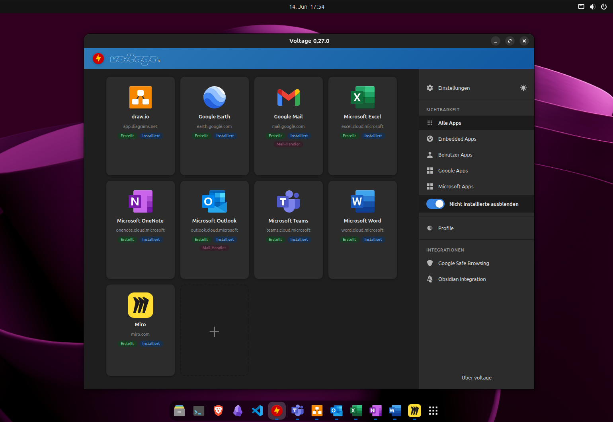

```
            ____               
 _  _____  / / /____ ____ ____ 
| |/ / _ \/ / __/ _ `/ _ `/ -_)
|___/\___/_/\__/\_,_/\_, /\__/ 🐧
                    /___/                       
```
[](https://github.com/db0x/voltage)
[](LICENSE)
[](https://www.electronjs.org/)
[](https://github.com/db0x/voltage/actions/workflows/test.yml)

***Wrap any web app. Make it feel native.***

Turn any *web app* into a standalone Linux *desktop application* — packaged as an AppImage with its own window, session, and taskbar entry.

Built on [Electron](https://www.electronjs.org/). Each app gets an isolated browser profile, so WhatsApp, Teams, Google Earth and your own internal tools run side by side without interfering.

> **Target: Linux 🐧** — built and tested on GNOME and KDE Plasma under Wayland. Correct WM class, taskbar grouping, window management and the Manager's native icon integration work on both. X11 may work but is not actively tested.

## Installation

The quickest way to get started is the install script:

```bash
bash <(curl -fsSL https://raw.githubusercontent.com/db0x/voltage/main/install.sh)
```

> **No curl?** Ubuntu 24.04+ no longer ships it pre-installed: `sudo apt install curl`.

The script checks for **Node.js ≥ 20** (offering to install it via [nvm](https://github.com/nvm-sh/nvm) if missing) and **npm**, warns about missing optional dependencies (FUSE, python3-gi, aspell), clones the repository to `~/.local/share/voltage` (or a path passed as the first argument), runs `npm install`, and creates a **Voltage** launcher entry. Re-running it on an existing install does a `git pull` and reinstalls dependencies.

### Uninstall

```bash
~/.local/share/voltage/install.sh --uninstall
```

Removes the launcher entry and icon, then asks whether to also delete the installation directory and the app profile data (`~/.config/voltage/`).

### Manual setup

```bash
git clone https://github.com/db0x/voltage.git
cd voltage
npm install
npm start
```

## Features

- **Isolated sessions** — each app has its own persistent profile; cookies, storage and login state never bleed across apps.
- **Native feel** — no browser chrome, correct WM class for taskbar grouping and window management.
- **Context menu** — a single self-rendered overlay (no native menus). Plain right-click shows spell-check suggestions (Electron's checker, falling back to `aspell`) plus Cut / Copy / Paste; **Ctrl+right-click** opens the full menu (Cut / Copy / Paste, **Open with [App]** / **Open in browser** for links, **Save image as**, and plugin actions). The Ctrl variant fires on the raw mouse button, so it works even where apps suppress `contextmenu` (Teams/Office), inside cross-origin iframes, and over window-drag regions.
- **Cross-app link routing** — a link handled by another installed Voltage app opens in that app instead of the browser. A `routing.json` file (written on install, read at runtime) maps URLs to apps, so no rebuild is needed when routing changes. Apps opt into extra URLs via `routingUrls` (with `*` wildcards) in the create/edit dialog.
- **Per-app plugins** — main-process modules under `webapps/plugins/` that extend a single app (e.g. the [ms-office plugin](webapps/plugins/ms-office/README.md) routing OneDrive document opens to Word/Excel/PowerPoint, or driving a webmail compose UI for `mailto:`). Selected per app in the dialog; a configurable plugin ships its own settings dialog (`config.html`) and stores values per app in `pluginConfig`. Changes take effect after a rebuild.
- **Widget mode** — the **widget** plugin renders an app as a frameless, rounded desktop widget (optional drop shadow, tint, hidden scrollbars), with a fade-in **top drag handle** carrying the window controls, since a frameless window loses the native ones. Combined with the [GNOME integration](#gnome-integration) it can be kept out of the dock entirely. Details (rendering model, drag strip, all options) in the [plugin README](webapps/plugins/widget/README.md).
- **Open an app's config from the Manager** — launching the Manager with `--voltage-edit-config=<profile>` opens it straight into that app's edit dialog (and focuses the already-running Manager if there is one). This is the interface the widget drag handle's configure (gear) button uses to jump from a running app straight to its settings.
- **About panel** — `F12` toggles an in-app overlay with the current domain (plus a Google Safe Browsing badge when enabled), the app, the build versions (Voltage / Electron / Chromium), and the loaded plugins.
- **Zoom** — the optional **zoom** plugin adds `Ctrl+Scroll` zoom with an on-screen percentage panel and a context-menu submenu (in / out / reset); step size and bounds are set in its config dialog.
- **Custom CSS** — the optional **css-inject** plugin injects a per-app stylesheet into the wrapped page (set in its config dialog) to restyle or hide elements of the site — flicker-free at document start, reaching cross-origin iframes too. Details in the [plugin README](webapps/plugins/css-inject/README.md).
- **Local Docker backends** — the optional **docker-integration** plugin routes an app to a locally running Docker container instead of its online service: the AppImage starts the bundled compose stack on launch (auto-picking a free port), waits until it actually answers, and tears it down on exit. Details in the [plugin README](webapps/plugins/docker-integration/README.md).
- **System integration** — register an app as the default `mailto:` handler or as a file-type handler (see below).
- **Screen sharing** — WebRTC / PipeWire capture works out of the box.
- **Shortcuts** — `Shift+F12` toggles DevTools, `F11` toggles fullscreen. In widget mode (frameless) `Shift+F11` additionally toggles maximize/restore, since a frameless window has no titlebar control to maximize it otherwise.
- **Single-instance enforcement** — optionally focus the existing window instead of opening a second one.
- **Private builds** — configs matching `webapps/build.private.*.json` are gitignored.

## Manager

Running `npm start` without a profile opens the **Voltage UI** — a graphical overview of all configured apps and the primary interface for adding, configuring, building, installing and launching them. The UI language follows the system locale (German and English supported).



### App cards

Each app is a card showing its icon, name, URL and status badges. Hovering reveals a three-button toolbar:

| Button | Action | Shown / enabled |
|---|---|---|
| Info / Edit | Opens the read-only info dialog (embedded apps) or the edit dialog (user apps) | always — one or the other, depending on the app type |
| Build & Install | Builds the AppImage and installs its launcher in a single step (label becomes **Rebuild & Install** once built) | always |
| Delete | Removes the AppImage and `.desktop` file; profile data is kept (user apps can also drop the config) | when built, or for any user app |

Clicking the icon launches the app (only when built and installed; otherwise the icon appears greyed out). Only one build runs at a time; a full-screen overlay blocks other actions while it runs.

### Adding a new app

The **+** card opens the **Create App** dialog. All options are available from the Manager:

| Field | Notes |
|---|---|
| Profile | Unique identifier — lowercase letters, digits and hyphens; checked for uniqueness live |
| Name | Optional display name (derived from the profile if empty) |
| URL | The URL loaded on startup |
| Icon | A searchable picker over the system icon theme |
| Categories | Group the app under one or more categories — pick existing ones from the dropdown or type a new name to create it |
| AppImage folder | Where the AppImage is built (native folder picker; empty = the project's `dist/`) |
| Profile folder | Where the app stores its session/profile data (native folder picker; empty = `~/.config/voltage/<profile>`) |
| Width / Height | Initial window size (optional) |
| User-Agent | A preset, or empty for the default Electron UA |
| Internal domains | Extra domains that open inside the app window (e.g. OAuth redirects) |
| Routing URLs | Extra URLs other apps (and Obsidian) route here — supports `*` wildcards, checked for overlap |
| Cross-Origin Isolation | Enables `SharedArrayBuffer` (multi-threaded WASM) |
| Single instance | Allow only one window at a time |

New apps are saved as `webapps/build.private.<profile>.json` and are gitignored automatically. The **Info** dialog shows every configured value and the filesystem paths; the **Delete** dialog for user apps can optionally remove the config file too (otherwise the card returns on next launch).

### Side menu

The menu offers light/dark mode, the visibility filters (all / embedded / user, plus one button per category in use — see [categories](#adding-a-new-app)), **Hide uninstalled**, **Profiles**, and the integration dialogs — **Mail handler**, **Google Safe Browsing**, **rclone**, **Obsidian** and **GNOME** — each shown only when relevant to your system. Each category filter carries a rebuild button on the right that recreates and installs every app in that category in one go (after a confirmation).

**Frameless window** (toggle in **Settings** → *Appearance*): drops the native window decoration and renders the Manager as a rounded, shadowed card with its own header drag area and Close button — the same look as the "app unavailable" dialog. The setting is persistent; saving it recreates the window to apply. Under Wayland the window is moved via its header and resized from its edges by the compositor.

## System mail handler

Voltage can register a web mail app as the system-wide default for `mailto:` links. Once set, clicking a `mailto:` link anywhere — browser, PDF viewer, terminal, Teams — opens a compose window in the configured app. No native mail client required.

The app's `.desktop` file declares `MimeType=x-scheme-handler/mailto`; installing it via the Manager prompts whether it should also become the **active default** (`xdg-mime default`). The `mailto:` URL is converted to the provider's compose URL via `mailtoTemplate` and an optional `mailtoParamMap` (see [Config reference](#config-reference)). The Manager shows a **Mail handler** badge on every capable app and marks the active default with **✓**.

Included mail-capable apps: **Microsoft Outlook** (`build.outlook.json`) and **Google Mail** (`build.google-mail.json`).

## File handler apps

A web app can act as the system handler for a file type, so double-clicking a file opens it in the wrapped app.

**draw.io** (`build.drawio.json`) wraps [app.diagrams.net](https://app.diagrams.net) and registers as the handler for `.drawio`, `.drawio.svg` and `.drawio.png`. After installing, double-clicking such a file opens it with the correct title; **Save** (`Ctrl+S`) and **Save As** write to disk through the system file dialog, just like a native app.

## rclone Integration (Google Drive)

Voltage can handle Office formats through **Google Drive** via [rclone](https://rclone.org/): double-clicking a `.docx`, `.xlsx` or `.pptx` uploads it to Drive and opens it in Google Docs, Sheets or Slides. Closing the window syncs the edited file back to its original local path.

**Prerequisites:** [rclone installed](https://rclone.org/install/) with a configured [Google Drive remote](https://rclone.org/drive/).

**Setup:** build and install the relevant app(s) — **Google Docs**, **Google Spreadsheets**, **Google Presentation** — then open the side menu → **rclone Integration**, pick your remote, set a target Drive folder per app (default: the profile name), and save.

When you open a file, Voltage checks whether a same-named file already exists on Drive: identical files open directly, differing ones show a comparison dialog (overwrite vs. open the Drive version), new ones are uploaded to the configured folder (created automatically on first use). On close, the Drive version is synced back to the local path.

## Google Safe Browsing

Voltage can check every external link you hover against the **Google Safe Browsing** database, showing a shield in the link tooltip — green for safe, red for a known threat.

**Privacy:** only the URL **origin** (`https://example.com`) is ever involved, and never in plain text — it is hashed with SHA-256, only the first 4 bytes of the hash are sent (`fullHashes:find`), Google returns all matches for that prefix, and the final comparison happens locally. Results are cached per origin (5 min safe / 30 min flagged).

**Setup:** create an API key in the [Google Cloud Console](https://console.cloud.google.com/) (enable the **Safe Browsing API**), then open the side menu → **Google Safe Browsing**, enable the toggle, paste the key and save. No rebuild needed — the key and state are read at runtime from `~/.config/voltage/safe-browsing.json`.

## Obsidian Plugin

Voltage ships a plugin for [Obsidian](https://obsidian.md/). Once installed, external links in your notes that match a Voltage-routed app open directly in that app; all external links show a **link tooltip** (app icon + URL for Voltage targets, browser icon + URL otherwise), matching the tooltips in Voltage app windows.

**Prerequisites:** Obsidian ≥ 1.12.7 with at least one vault, and at least one Voltage app installed (so `routing.json` exists).

**Setup:** open the side menu → **Obsidian Integration**. The dialog lists all known vaults with their plugin status; **Install plugin** copies the plugin into each vault's `.obsidian/plugins/voltage/`. Then enable it in Obsidian under **Settings → Community Plugins → Voltage**. When a newer plugin version ships, the dialog shows **Update available** per vault with an **Update plugin** button.

**Obsidian via Flatpak:** a sandboxed Obsidian cannot spawn AppImages from your home directory without an extra permission. The dialog detects this and offers the one-time command (with a copy button):

```
flatpak override --user --filesystem=home md.obsidian.Obsidian
```

Run it once and restart Obsidian.

The plugin reads `~/.config/voltage/plugins/routing/routing.json` at runtime (the same file written on every app install) and works in both **Reading Mode** and **Live Preview**, so no rebuild or Obsidian restart is needed when routing changes.

## GNOME Integration

Under Wayland an AppImage cannot control its own window state, so a frameless **widget** app cannot remove itself from the taskbar. Voltage ships a small GNOME Shell extension that does it from the shell side: while active, it hides the marked Voltage widget windows from the GNOME **dash** and **dash-to-dock**. The window stays focusable and alt-tabbable — it just no longer gets a dock icon.

This is controlled per app by the widget plugin's **Show in taskbar** toggle (widget config dialog). It is **off by default** — a widget is normally kept out of the dock — so a new widget app is hidden automatically; enable the toggle for the rare widget you want to keep in the dock.

**Remembered window position:** the extension also restores **every Voltage app** — widget or not — to where you last left it. This is independent of the **Show in taskbar** setting: as long as the extension is active, the feature applies to all Voltage AppImages. When an app window closes, its frame (position + size) is saved to `widget-geometry.json` **inside that app's own profile-data folder** (`~/.config/voltage/<profile>/`, or a custom `profileDir` if set); on the next launch the window opens at that exact spot. The extension finds the folder from the `X-Voltage-ProfileDir` line the Manager writes into every Voltage app's `.desktop` launcher. This is again a Wayland necessity — a client cannot position its own window, only the compositor can. The restore is **monitor-aware**: if your display layout has changed so the saved frame would land off-screen (a monitor unplugged or rearranged), the saved position is ignored and GNOME places the window normally, so a window can never disappear into a monitor that no longer exists.

**Centered notice dialog:** for the same Wayland reason, the extension also **centers** the "app unavailable" notice (the Voltage-styled dialog shown when an app's AppImage is unreachable — see [Launcher indirection](#launcher-indirection-encrypted-appimage-directories)). It recognizes that one window by a stable marker title and centers it on its current monitor; without the extension the dialog still appears, but the compositor decides where.

**Setup** (requires a GNOME Shell session, GNOME 46–50): open the side menu → **GNOME Integration** (only shown under GNOME) → **Install extension**. The files are copied into `~/.local/share/gnome-shell/extensions/voltage@db0x.de/` and enabled. On **Wayland** you must log out and back in once so GNOME loads the new extension — the dialog shows a hint when this is required.

**How it works:** the Manager adds `X-Voltage-Widget=true` to a widget app's `.desktop` launcher unless its **Show in taskbar** toggle is on. The extension scans those launchers (and watches the directory), collects the marked app IDs, and wraps `Shell.AppSystem.get_running()` to drop them — the one seam both the stock dash and dash-to-dock read from. Installing, editing or deleting an app updates its launcher, so the hidden set stays correct automatically.

## Included app configs

| Config | App |
|---|---|
| [`build.claude.json`](webapps/build.claude.json) | Claude (Anthropic) |
| [`build.drawio.json`](webapps/build.drawio.json) | draw.io |
| [`build.google-docs.json`](webapps/build.google-docs.json) | Google Docs |
| [`build.google-drive.json`](webapps/build.google-drive.json) | Google Drive |
| [`build.google-earth.json`](webapps/build.google-earth.json) | Google Earth |
| [`build.google-gemini.json`](webapps/build.google-gemini.json) | Google Gemini |
| [`build.google-mail.json`](webapps/build.google-mail.json) | Google Mail |
| [`build.google-notes.json`](webapps/build.google-notes.json) | Google Keep |
| [`build.google-presentation.json`](webapps/build.google-presentation.json) | Google Presentation |
| [`build.google-spreadsheets.json`](webapps/build.google-spreadsheets.json) | Google Spreadsheets |
| [`build.openai.json`](webapps/build.openai.json) | OpenAI ChatGPT |
| [`build.excel.json`](webapps/build.excel.json) | Microsoft Excel |
| [`build.outlook.json`](webapps/build.outlook.json) | Microsoft Outlook |
| [`build.powerpoint.json`](webapps/build.powerpoint.json) | Microsoft PowerPoint |
| [`build.teams.json`](webapps/build.teams.json) | Microsoft Teams |
| [`build.word.json`](webapps/build.word.json) | Microsoft Word |
| [`build.miro.json`](webapps/build.miro.json) | Miro |
| [`build.whatsapp.json`](webapps/build.whatsapp.json) | WhatsApp |

## Requirements

- **git** — used by `install.sh` to clone and update the repository
- **Node.js ≥ 20**
- **Linux** (Wayland recommended)
- **libfuse2** — required to run AppImages (FUSE 3 alone is not enough; AppImages need `libfuse.so.2`):
  - Ubuntu 24.04+: `sudo apt install libfuse2t64` · Ubuntu 22.04 / Debian: `sudo apt install libfuse2`
  - Fedora: `sudo dnf install fuse-libs` · Arch: `sudo pacman -S fuse2`
- **python3-gi** — GTK bindings the Manager uses to resolve system icon-theme icons (`sudo apt install python3-gi`)
- **gtk-update-icon-cache** / **update-desktop-database** — run after installing an app; usually present via `libgtk-3-bin` and `desktop-file-utils`
- **aspell** — spell-check suggestions (optional; e.g. `sudo apt install aspell-de`)

## Libraries

| Library | Used for |
|---|---|
| [Electron](https://www.electronjs.org/) | App shell, renderer, IPC |
| [electron-builder](https://www.electron.build/) | AppImage packaging |
| [OverlayScrollbars](https://github.com/KingSora/OverlayScrollbars) | Native-style overlay scrollbars in the Manager |
| [Coloris](https://github.com/mdbassit/Coloris) | Colour picker (with alpha) for plugin settings, via [@melloware/coloris](https://github.com/melloware/coloris-npm) |
| [Papirus Icon Theme](https://github.com/PapirusDevelopmentTeam/papirus-icon-theme) | Some Manager icons |

## Building AppImages via CLI

The Manager covers build and install for most cases. For scripted or headless workflows, the CLI scripts remain:

```bash
npm run build                        # build all configs
npm run build -- whatsapp            # build a single app
npm run build -- private.myapp

npm run install-app -- whatsapp      # (re-)install the launcher without rebuilding
npm run install-app                  # all configs
```

Output lands in `dist/` as a self-contained AppImage, named after the profile with a leading `v` and an upper-cased first letter — e.g. profile `teams` builds `dist/vTeams`, installs `vTeams.desktop`, and registers the icon `vTeams.svg`. The profile itself stays lowercase and is the stable identity for the app's session directory under `~/.config/voltage/<profile>/`.

### Launcher indirection (encrypted AppImage directories)

Every app's `.desktop` file does **not** point `Exec=` at the AppImage directly. Instead it routes through one shared launcher script at `~/.local/share/voltage/voltage-launch`, passing the AppImage path as its first argument. The reason is GNOME/GIO: it drops a `.desktop` entry entirely when the `Exec=` binary cannot be resolved on disk — so if the AppImage lives in an **encrypted/locked** directory, the starter silently disappears and is **not** restored after unlocking (the app index is cached until the `.desktop` file itself changes). Because the shared launcher always lives in the unencrypted home, GIO can always resolve it and keeps the entry visible. If the real AppImage is unreachable when launched (project still locked), the launcher boots the Manager app in **notice mode** (`--voltage-notice`) to show a Voltage-styled "app unavailable" dialog instead of failing silently. The launcher is (re)written automatically on every install.

## Manual config (advanced)

Apps can also be configured by hand — useful for bulk setup, version-controlled shared configs, or options not yet exposed in the UI. Configs live in `webapps/`; use `webapps/build.private.<name>.json` for ones you don't want to commit (gitignored automatically).

### Config reference

| Field | Type | Description |
|---|---|---|
| `profile` | string | **Required.** Unique identifier — used for the session, userData path and app IDs |
| `url` | string | **Required.** URL to load on startup |
| `name` | string | Display name (default: derived from `profile`) |
| `icon` | string | Icon name resolved from the system icon theme |
| `category` | string \| array | One or more categories the app belongs to, used by the drawer filters. Assigned via the create/edit dialog's category picker; a single string (e.g. `"microsoft"`) is also accepted |
| `userAgent` | string | Override the user-agent string |
| `geometry.width/height` | number | Initial window size (default: 1280 × 1024) |
| `geometry.x/y` | number | Initial window position — _deprecated, X11 only_ |
| `outputDir` | string | Absolute folder the AppImage (and its `.version` sidecar) is built into. Default: the project's `dist/`. Editing it in the Manager moves an already-built AppImage to the new folder |
| `profileDir` | string | Absolute folder for the app's session/profile data (cookies, logins, cache). Default: `~/.config/voltage/<profile>`. Baked into the AppImage at build time, so a change takes effect after the next rebuild; editing it in the Manager moves existing data to the new folder |
| `internalDomains` | string \| array | Extra domains allowed to open inside the app window (e.g. OAuth providers) |
| `routingUrls` | array | Extra URLs that route to this app, in addition to `url`. Each entry is `host[/path]` and may use `*` as a greedy wildcard. Matching runs against path **and** query string and may carry **negative clauses** — see [Advanced routing patterns](#advanced-routing-patterns). A routing URL may overlap another app's **base** URL (the routing URL wins), but not another app's **routing** URL |
| `crossOriginIsolation` | boolean | Enable `SharedArrayBuffer` — required for multi-threaded WASM (Google Earth) |
| `singleInstance` | boolean | Allow only one instance; a second launch focuses the existing window |
| `blockWindowClose` | boolean | Neutralise the page's own `window.close()`. Needed by apps like Teams that call it during login and would otherwise close themselves. The WM close and context-menu Quit still work; widget apps get this automatically |
| `devTools` | boolean | Allow Chromium DevTools (default `true`). Set `false` to disable them entirely — the F12 shortcut, the context menu and `openDevTools()` all become no-ops, and the widget's top drag strip hides its DevTools button |
| `mimeTypes` | array | Schemes or MIME types this app handles (e.g. `["x-scheme-handler/mailto"]`, `["application/x-drawio"]`) |
| `mimeExtensions` | object | Maps MIME types to file extensions for system registration (e.g. `{ "application/x-drawio": ["drawio"] }`) |
| `mimeIcons` | object | Maps MIME types to SVG asset filenames (from `assets/`) installed as file-type icons |
| `fileHandler` | boolean | Enable local file handling (files passed by the system are read and handed to the app); also grants the File System Access permission |
| `acceptsFileArg` | boolean | Allow a bare local file path as a launch argument. Needed by plugins such as `rclone-sync`; implied by `fileHandler` |
| `rcloneEditUrlBase` | string | Editor URL base for the `rclone-sync` plugin (e.g. `"https://docs.google.com/document/d"`); the editor URL becomes `<base>/<id>/edit` |
| `mailtoTemplate` | string | Compose-window base URL; `mailto:` parameters are appended as a query string |
| `mailtoParamMap` | object | Rename `mailto:` parameters before appending (e.g. `{ "subject": "su" }` for Gmail) |
| `plugins` | array | Plugins this app loads, each a webapps-relative path (e.g. `"plugins/onedrive/onedrive.js"`). A plugin exports `attachPlugin(win, api)`. Changing the selection requires a rebuild |
| `pluginConfig` | object | Per-plugin settings keyed by the plugin's webapps-relative path (e.g. `{ "plugins/widget/widget.js": { "radius": 20 } }`). Configurable plugins expose a gear button in the dialog and receive these as `api.config` at runtime. Options per plugin: [widget](webapps/plugins/widget/README.md) (frameless widget look & drag strip), [css-inject](webapps/plugins/css-inject/README.md) (per-app stylesheet), [docker-integration](webapps/plugins/docker-integration/README.md) (local container stacks, env/secrets); the **zoom** plugin offers step size and min/max bounds. Changing a value requires a rebuild |

### Advanced routing patterns

> ⚠️ **Rarely needed** — only reach for these when a plain `host/path*` pattern genuinely cannot tell two apps apart. They exist for one case: Microsoft 365 documents on SharePoint.

A routing pattern is matched against the **path *and* query string** and may contain **negative clauses**:

**1. The query string is part of the match.** The matcher tests `pathname + "?" + search`, because SharePoint opens every Office document through the *same* endpoint and only the query differs:

```
https://contoso.sharepoint.com/sites/X/_layouts/15/Doc.aspx?sourcedoc=…&file=Report.docx
                               └────────── path (identical for all) ──────┘ └─ only query differs ─┘
```

So Word claims `"https://*.sharepoint.com/*.docx*"`, Excel `"*.xlsx*"`, PowerPoint `"*.pptx*"`. (Share-style links instead carry a scheme token in the path — `:w:`/`:x:`/`:p:`/`:o:` — which each app also claims.)

**2. `!` adds negative clauses: `positive!not-this!not-that`.** The pattern matches only if the positive part matches **and none** of the `!`-separated globs do. The only real use is **OneNote**, whose link goes through the same `Doc.aspx` as Word but carries no file extension, so it claims "a `Doc.aspx` link that is *not* one of the other three Office types":

```json
"routingUrls": [
    "https://*.sharepoint.com/:o:/*",
    "https://*.sharepoint.com/*Doc.aspx*!*.docx*!*.xlsx*!*.pptx*"
]
```

Because `findRoute` tries the longest key first, a `Report.docx` URL hits this OneNote key, its negation rejects it, and resolution falls through to Word. The same matcher (`src/routing-match.js`) is shared by app windows, the Obsidian plugin and the build-time table generator, so the rules behave identically everywhere.

### Examples

```json
{ "profile": "google-docs", "url": "https://docs.google.com" }
```

```json
{
    "profile": "claude",
    "name": "Claude",
    "icon": "claude",
    "url": "https://claude.ai",
    "internalDomains": ["accounts.google.com", "github.com"]
}
```

```json
{
    "profile": "google-earth",
    "url": "https://earth.google.com",
    "crossOriginIsolation": true,
    "userAgent": "Mozilla/5.0 (X11; Linux x86_64) AppleWebKit/537.36 (KHTML, like Gecko) Chrome/142.0.0.0 Safari/537.36"
}
```

## Session data

Each app stores cookies, localStorage and cache under `~/.config/voltage/<profile>/`. Profiles are fully isolated and persist across restarts.
